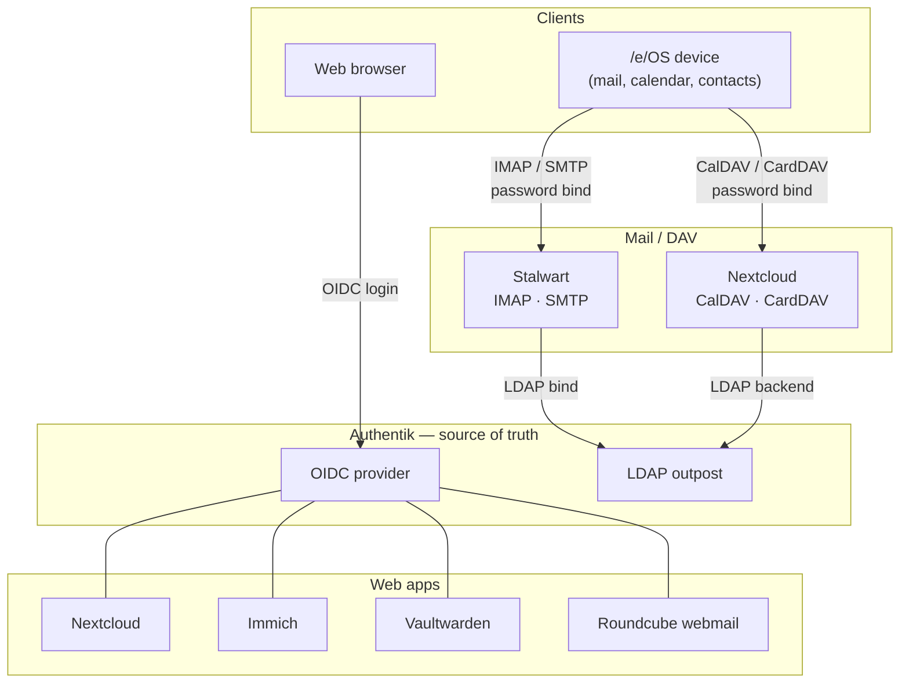

# after/e/ — Architecture

**after/e/** is a self-hosted personal-cloud stack: a coordinated deployment of
Authentik, Nextcloud, Stalwart, Immich, Vaultwarden, and a webmail client, glued
together with an installer and a set of lifecycle scripts. It is a spiritual
successor to the `/e/Cloud` self-hosting stack — a departure from it, not a fork
of it — built around a single identity provider and a bias toward components
that will still exist, and still be under your control, in five years.

This document is the *why*. It records the architectural decisions and the
reasoning behind each one, so that a maintainer who is not the original author
can understand not just what the stack does but why it is shaped the way it is.
It is also, deliberately, the design-rationale case for anyone evaluating this as
an alternative to shipping a stale vendored copy of Nextcloud: the pitch and the
architecture are the same document.

---

## Design principles

Four principles drive nearly every decision below. Where a tradeoff was close,
these broke the tie.

**Vendor independence.** Every component earns its place against the question
"will this project, and my ability to run it myself, still exist in five years?"
This favors self-hostable, open, standards-based software over anything whose
continued operation depends on a vendor's business model.

**Graceful degradation.** When a dependency disappears or breaks, the system
should degrade rather than fail catastrophically. Data stores are isolated so one
corruption does not cascade; the mail server accepts inbound mail even when an
identity lookup is slow; a missing optional component removes a feature, not the
stack.

**Minimum viable disclosure.** The stack collects and exposes the least data
necessary. This shows up in credential scoping (least-privilege API tokens), in
data minimization defaults, and in a refusal to phone home.

**Own your update cadence.** A self-hosted stack should let the operator decide
when to move, rather than inheriting a vendor's shipping decisions — including a
vendor's decision to ship five versions out of date. Controlling the version pins
*is* part of the value proposition.

---

## The core decision: Authentik as the single source of truth

Every other decision in this document follows from one choice: **Authentik is the
authoritative identity provider, and every other component authenticates against
it.** There is one place a user exists, one password, one place to disable an
account.

This is the single biggest departure from `/e/Cloud`, which predates good
federation and therefore wires account creation directly into each application.
Here, a user is created once in Authentik, and the applications provision
themselves from it.

Authentik exposes identity two ways, and the stack uses both deliberately:

- **OIDC**, for the web surfaces — Nextcloud, Immich, Vaultwarden, the Stalwart
  admin UI, and webmail all do single sign-on via OpenID Connect. Apps
  just-in-time provision a local account on first login.
- **An LDAP outpost**, for the credential surfaces that cannot present an OIDC
  token — IMAP, SMTP, CalDAV, CardDAV. A mail client or a DAV client presents a
  username and password; there is no browser in the loop to carry a token. The
  LDAP outpost lets those clients bind against Authentik directly, so the *same*
  Authentik password works for mail and calendar sync as for the web apps, with
  no per-service "app password" dance.

Choosing the LDAP outpost over an OIDC-plus-app-passwords model is what makes the
phone onboarding feel like a single identity rather than a scavenger hunt for
protocol-specific credentials. It has one honest cost, documented under
[MFA](#multi-factor-authentication): a password bind is single-factor by nature.

### Secrets: generate-and-inject, via blueprints

The identity wiring is declarative. Authentik's OIDC providers, applications,
property mappings, and the LDAP outpost are defined as **Authentik blueprints** —
YAML applied at first boot — rather than assembled by a script making imperative
API calls after the fact.

The client secrets those integrations require are **generated up front and
injected into both sides**: the installer mints each secret, writes it into
Authentik's blueprint *and* into the dependent service's configuration, so both
ends hold the same value with no read-back step. This "generate-and-inject"
direction is chosen specifically because it collapses the ordering problem — there
is no "boot Authentik, read the secret out, feed it forward" dance to sequence and
fail at.

A blueprint applies asynchronously, and a malformed one leaves Authentik *healthy*
but missing the providers. The installer therefore verifies, via Authentik's API,
that the applications and outpost actually exist before starting anything that
depends on them. See [Installation model](#installation-model).

---

## Components and responsibilities

The stack assigns exactly one owner to each kind of data. This is the rule that
prevents the two most expensive failure modes in a multi-app cloud: redundant
storage and replication drift.

| Concern | Owner | Notes |
|---|---|---|
| Identity / auth | **Authentik** | Required. OIDC for web, LDAP outpost for mail/DAV. |
| Files / sync | **Nextcloud** | Required. |
| Calendar / contacts (PIM) | **Nextcloud** | CalDAV/CardDAV. The mail server does **not** own PIM. |
| Mail (IMAP/SMTP) | **Stalwart** | Optional. Mail only — no groupware. |
| Photos | **Immich** | Optional. When present, Nextcloud photo auto-upload is disabled by default. |
| Passwords | **Vaultwarden** | Optional. OIDC SSO; master password retained by design. |
| Webmail | **Roundcube** | Optional (present with mail). Queries Nextcloud contacts via CardDAV. |
| Edge security | **CrowdSec** | Bouncer on the frontend proxy. |

Two of these assignments are load-bearing enough to justify their own sections.

### PIM lives in Nextcloud, not in the mail server

`/e/OS`'s native mail app is a fork of K-9 Mail, which speaks IMAP and POP only —
no ActiveSync. Calendar and contacts sync over CalDAV/CardDAV through `/e/OS`'s
own account layer. That single fact settles two things:

1. Any mail server's ActiveSync capability is irrelevant to this target. It cannot
   be consumed by the client we are building for.
2. There must be exactly one owner of calendar/contacts, or the phone syncs from
   two places and something has to replicate between them.

Nextcloud is a required component in every tier and already speaks CalDAV/CardDAV,
so **Nextcloud owns PIM** and the mail server owns only mail. The phone's mail app
talks IMAP to the mail server; the phone's calendar and contacts talk DAV to
Nextcloud. No replication, because there is one owner per data type. A corollary:
the mail server's own groupware/DAV surface is left unused, which is part of why
the mail server does not need to be a heavyweight groupware suite.

### Photos: one uploader

Immich and Nextcloud both want to be the phone's photo destination. If both are
active, the phone auto-uploads to both, doubling storage *and* mobile-data usage —
harmless on an unmetered 3 TB box, painful for anyone paying by the gigabyte for
storage or bandwidth. When Immich is selected, **Nextcloud's photo auto-upload and
memories features are disabled by default**, and Immich is the sole uploader. This
is a config consequence, not a script check: Nextcloud's `occ` setup differs based
on whether Immich exists in the deployment.

---

## Mail architecture

Mail is the most-scrutinized choice in the stack, so the reasoning is spelled out.

### Why Stalwart, not mailcow

The obvious default for a self-hosted mail stack is mailcow, and it is a fine
choice for its intended audience. But once PIM ownership moves to Nextcloud, the
mail server's job collapses to IMAP + SMTP + spam filtering + deliverability — and
on that narrowed job, mailcow's advantages largely evaporate while its costs do
not:

- Mailcow is a dozen-plus containers (its groupware, full-text search, and
  antivirus components are individually RAM-hungry). On a 16 GB target where
  resource headroom is the binding constraint, that is a heavy price for
  capabilities — ActiveSync, bundled groupware, SOGo webmail — that this
  architecture does not use.
- Stalwart is a single Rust binary that provides SMTP, IMAP, JMAP, a built-in
  spam filter, autoconfig/autodiscover, first-class DKIM/DMARC/ARC/MTA-STS/TLS-RPT,
  a web admin UI, and native LDAP/OIDC directory integration — at roughly an order
  of magnitude less memory. Configuration is one TOML file, which diffs cleanly in
  git and is a far kinder handoff to a future maintainer than a container zoo.

The honest costs of this choice: Stalwart is younger and less battle-tested in
large-scale production than mailcow, and its spam filter, while competitive, is
newer than mailcow's mature rspamd tuning (it can call out to rspamd or
SpamAssassin via milter if needed). For a stack whose entire value proposition is
resource-efficient, maintainable self-hosting, lightness and operational
simplicity won the tradeoff. Deployers running unusually deliverability-sensitive
or high-volume mail should weigh mailcow instead; the architecture's identity and
PIM decisions do not depend on which mail server is used, only the mail-specific
glue does.

### Stalwart uses Authentik as an external directory

Stalwart can run an internal directory (it owns accounts) or an external one
(LDAP/OIDC/SQL). after/e/ uses **external LDAP against Authentik's outpost**, which
makes Authentik authoritative for account existence, login name, primary address,
aliases, group membership, and authentication.

Two operational details a maintainer must know:

- **Bind authentication is required.** Authentik's outpost does not expose password
  hashes to a service account, so Stalwart must authenticate by binding as the user
  (`bindAuthentication = true`). With hash-comparison mode it will silently fail
  every login. This is the first thing to check if auth "mysteriously" fails.
- **Quota is held Stalwart-side.** In current Stalwart versions, disk quota is a
  property of Stalwart's own account/tenant object rather than read from an LDAP
  attribute (this behavior has changed across versions — verify against the
  installed version). A sensible default quota set once at install means per-user
  account creation does not need to touch Stalwart at all; only a *non-default*
  per-user quota requires a Stalwart-side call.

A Stalwart account materializes lazily on first login or first delivery, but
because Stalwart validates recipients against LDAP, **inbound mail is accepted for
a user who has never logged in** — the address is valid the moment the Authentik
user exists.

### Webmail: Roundcube querying Nextcloud contacts

Webmail is Roundcube, not the mail server's bundled client, for one reason: the
composer must autocomplete against the *same* contacts the phone syncs — i.e.
Nextcloud's. Roundcube's CardDAV plugin points at Nextcloud's CardDAV endpoint, so
the webmail address book and the phone address book are the same address book, by
construction, with no replication. Roundcube is portable across mail servers, so
this choice is independent of the Stalwart-vs-mailcow decision.

### Spam and quarantine

Stalwart's built-in filter scores mail; probable spam lands in Junk, where it is
siftable over IMAP (so the "where did my password-reset email go" case is
recoverable). MailScanner was considered and rejected: it belongs to the
Postfix/SpamAssassin lineage, would be redundant with built-in filtering, and would
fight the single-binary design. A browsable-quarantine workflow, if wanted, is a
2.0 consideration — verify what the Stalwart admin UI already offers before adding
anything.

---

## Deployment tiers

The installer offers a small set of **tested** configurations rather than the full
combinatorial space of independent toggles. The container-level machinery is
cheap (Docker Compose profiles gate services from one compose file), but the
*interactions* between components are not — and only tested combinations are
shipped as supported. Publishing the matrix you have actually run is more honest,
and more maintainable, than claiming that all `2^n` combinations work.

| Tier | Auth | Files | PIM | Photos | Mail | Vault | Webmail |
|---|:---:|:---:|:---:|:---:|:---:|:---:|:---:|
| **Kitchen Sink** (default, most-tested) | ✅ | ✅ | Nextcloud | Immich | ✅ | ✅ | ✅ |
| Everything but Mail | ✅ | ✅ | Nextcloud | Immich | — | ✅ | — |
| Nextcloud Handles My Photos | ✅ | ✅ | Nextcloud | Nextcloud | ✅ | ✅ | ✅ |
| File Sync Only | ✅ | ✅ | Nextcloud | Nextcloud | — | — | — |

CrowdSec is present across tiers by default. Mail-plus-Immich (the heaviest
combination) is a shipped tier here specifically because Stalwart's small footprint
brings it back within the 16 GB ceiling that a heavier mail server would blow;
the README should state that resource-constrained hosts may still need to drop to a
lighter tier.

The three interaction rules that make these tiers safe are hard-coded, not
rediscovered per install:

1. **Mail is a DNS-dependency root.** Turning mail off removes the entire
   PTR/SPF/DKIM/DMARC/MTA-STS branch of the DNS preflight, the MX requirement, and
   the mail hostnames from the certificate SAN list. "Do you want email" is the
   single largest conditional in the installer.
2. **Immich-on disables Nextcloud photos.** See [Photos](#photos-one-uploader).
3. **The resource ceiling is real.** Tiers are chosen partly to keep the tested
   combinations inside 16 GB.

---

## Network and TLS topology

A single frontend nginx (raw, templated `.conf` files — not a database-backed proxy
manager, which would be hostile to a reproducible git-tracked deployment)
terminates TLS for every web hostname and reverse-proxies each service, including
the Stalwart admin UI and the autoconfig/autodiscover endpoints, to their internal
ports. One public IP is sufficient.

The critical subtlety: **nginx only fronts HTTP.** The mail protocol ports — 25,
465, 587, 993, 4190 — terminate TLS inside Stalwart and never pass through the
proxy. Certificate deployment therefore has to reach *both* nginx and Stalwart; a
proxy reload alone will not update the certificate the mail ports present.

Hostnames follow a flat `service.domain` scheme (Nextcloud at the apex,
`immich.`, `vault.`, `auth.`, etc.), with `mail.` as the IMAP/SMTP hostname clients
bind to and `stalwart.` for the admin UI. `autoconfig.`, `autodiscover.`, and
`mta-sts.` are protocol-mandated and appear as certificate SANs regardless of the
naming scheme.

### Certificate pipeline

The pipeline factors into one branching step and three shared ones. Only
*acquisition* branches; validation, deployment, and reload are common.

- **Acquire or locate** — four modes, selectable and tag-able per domain
  (defaulting to HTTP-01):
  - **HTTP-01** (default) — requires every hostname to resolve and port 80 open.
    The challenge location must be carved into nginx *ahead of* every `proxy_pass`,
    or the ACME challenge is swallowed by the proxied upstream. First-issue and
    renewal serve the challenge differently (standalone before nginx binds :80
    vs. webroot behind it).
  - **Cloudflare DNS-01** — prompts for a **scoped API token** (Zone → DNS → Edit),
    never the global key. Enables wildcard issuance, which collapses the SAN list
    and drops the per-host A-record requirement at issue time. A wildcard covers
    neither the apex nor multi-level names — both are added as explicit SANs where
    needed.
  - **BYO wildcard** and **BYO custom** — operator supplies the certificate files;
    nothing is issued. Collapsed into one "bring your own" path that validates
    three things that break silently: key/cert match, SAN coverage of every served
    hostname, and presence of the intermediate chain (leaf-only certs break mail
    TLS even where a browser tolerates them).
- **Validate → Deploy → Reload** — shared. Deployment fans a renewed certificate
  out to the nginx paths **and** into Stalwart's configuration, then reloads both.

The chosen mode is persisted to config, because the renewal path must branch
identically. **BYO opts out of auto-renewal** — the renewal cron becomes an expiry
*monitor* that warns and redeploys on change, not a renewer. Stalwart's own ACME is
disabled so it does not contend with this pipeline. CrowdSec's nginx bouncer reads
the frontend access logs.

The cert mode is selected *before* the DNS preflight, because it changes what the
preflight must require: `DNS gate = f(cert_mode, mail_mode)`.

---

## DNS is two-phase

`/e/Cloud` shows the operator one DNS table up front. after/e/ cannot, because DKIM
keys do not exist until the mail domain is created — which happens after the stack
is running. DNS is therefore split across the install/postinstall seam:

- **Phase 1 (pre-install gate):** A/AAAA, MX, and — on direct-delivery only — PTR,
  plus any `_acme-challenge` TXT records for DNS-01. Forward resolution is a hard
  failure; the install cannot proceed without it.
- **Phase 2 (post-install gate):** DKIM (read back from Stalwart after domain
  creation), plus SPF, DMARC, MTA-STS, and TLS-RPT finalization. The installer
  prints these records and waits.

Policy notes baked into the generated records:

- **DMARC starts at `p=quarantine`** (with reporting), not `p=reject`. Publishing
  `reject` before alignment is confirmed loses legitimate mail; the operator
  tightens to `reject` once reporting is clean.
- **SPF must authorize the relay** when relay mode is active — the box's own IP is
  not the sending identity in that case.

### Mail delivery mode, and what PTR is actually for

The first mail question is **relay vs. direct**, because it determines whether PTR
matters at all. Outbound reputation on a relay belongs to the relay, so a missing
PTR on the local IP is irrelevant under relay mode; PTR only matters for direct
delivery. The check is therefore gated behind the mode rather than special-cased.

- **Relay** (a generic authenticated SMTP relayhost, with host/port prefilled for
  Mailgun and SMTP2GO as named conveniences) is validated *early* with a `swaks`
  test-send against the relay's submission port, so a bad credential fails before
  the stack is built. The actual relayhost wiring happens in postinstall.
- **Direct** puts PTR back in the required set — but as a **soft** failure: forward
  resolution is mandatory, PTR is "warn and continue," with an env override for
  unattended runs.

A relay is **outbound-only**. Inbound mail still arrives at the MX and lands on the
server directly, so the mail host's A record, MX, and inbound port 25 remain
required regardless of delivery mode. Relay mode narrows the PTR check; it does not
retire the mail-DNS gate.

---

## Data and storage

### Database topology: separate

Databases are **not** shared. The cost is a few hundred megabytes per extra
Postgres; the benefit is that a corruption or a version-mismatch in one service's
database cannot take down another — directly serving graceful degradation, and
specifically keeping the authentication linchpin isolated from Nextcloud's data
layer.

- **Immich** pins its own vector-extension Postgres (version-sensitive) regardless.
- **Stalwart** and **Vaultwarden** use embedded stores (RocksDB / SQLite) and stay
  out of the Postgres question entirely — fewer shared failure domains.
- **Authentik** and **Nextcloud** each get their own database.

### Volume layout

All persistent data lives in **folder-based bind-mounts under a single configurable
root** (default `/mnt/aftere`), one subfolder per service. No file-level mounts, so
the layout works identically on raw Debian, DietPi, or a non-Debian host without
depending on how any particular distro provisions Docker volumes. The single-root,
transparent-folder layout is also what makes the backup story trivially simple.

### Backups

Deferred until there is data worth backing up, and intentionally minimal to start:
stop a service and its database, `tar` the relevant subfolders, restart. It runs
off-hours, accepts brief downtime during the archive, and favors a consistent
snapshot (databases are stopped, not hot-copied) over zero-downtime cleverness. A
more sophisticated story is a later increment.

---

## Installation model

The installer is two scripts across one seam: **`init`** takes the host from bare
to "stack running with valid certificates," and **`postinstall`** does everything
that can only happen once containers are up.

- **`init`:** tier selection → the two mode questions (mail, cert) → secret
  generation → DNS preflight (tuned by both modes) → certificate acquisition and
  deployment → Authentik brought up with blueprints and **verified** → dependent
  services started.
- **`postinstall`:** mail domain creation → the DKIM/Phase-2 DNS gate → Nextcloud
  `occ` configuration (LDAP backend against Authentik, trusted domains, app
  enable/disable, the Immich-aware photo-app disabling) → OIDC wiring for the web
  apps → CrowdSec → readiness polling in place of fixed sleeps.

### Answer file, and the resume model

All operator input is gathered **up front** into a persisted answer file, and the
installer resumes from it — so a failed run never re-prompts for information already
entered. This is the same questionnaire → answers → `.env` pattern `/e/Cloud` uses,
and its questionnaire engine is a legitimate reference (see [Provenance and
licensing](#provenance-and-licensing)).

**One deliberate divergence from the reference:** generated secrets are generated
**once and cached**, never regenerated on a resume. The reference implementation
re-runs its generation tokens on every invocation, which is harmless when the
script runs exactly once but corrupts a generate-and-inject deployment on
re-run — a freshly minted secret would no longer match the value already baked into
Authentik's blueprint. Generated values are written to the answer file on first
generation and read back verbatim thereafter.

The answer file holds secrets (generated and operator-supplied) the moment it
exists, so it is created `chmod 600` with correct ownership. On a **successful**
run the operator-answer portion is removed; the generated secrets by then live
authoritatively in the deployed configs, which the README directs the operator to
back up. Validation runs at **load time**, not only at prompt time, because
"edit the answer file to fix an error and re-run" is a supported recovery path and
must not bypass validation.

### Failure handling: fail fast, resume idempotently

The installer does **not** offer per-check abort/retry/ignore. Almost every check
has exactly one correct response to failure, and it is not "ignore" — a
mismatched key/cert or a non-resolving hostname produces a broken install if
ignored, just later and more confusingly. The one legitimate operator choice
(PTR-on-direct) is handled as its own explicit prompt.

Instead: **fail fast with a diagnostic that names the fix, exit non-zero, and make
re-runs idempotent.** Each step checks whether its work is already done before
acting (certificate valid? skip issuance; mail domain exists? skip creation), so
"fix the error and run it again" resumes cleanly. Idempotency at the step level is
the robust form of "retry" — and it is smaller to write than per-check
interactivity, because the fix for an infrastructure failure is almost always
outside the script anyway.

---

## User lifecycle

### Provisioning

Because Authentik is the source of truth and apps JIT-provision from it,
"create the user in each module" collapses into **create the user in Authentik and
assign the group memberships that gate application access.** The per-module choices
("Immich? Nextcloud? Mailbox? Vaultwarden?") are *which Authentik groups* the user
lands in; the apps materialize their local accounts on first OIDC login (web) or
first LDAP bind / mail delivery (Stalwart).

`new-user.sh` runs unattended with `--default` plus `--firstname/--lastname/
--username/--password` flags, or interactively otherwise. A `--password` sets the
Authentik password, which — because Authentik is LDAP-authoritative — is
immediately live for mail, DAV, and every web app at once. Batch creation is a loop
over a CSV.

Only two spots require pre-provisioning rather than trusting JIT: a **non-default
Stalwart quota**, and **Vaultwarden's organization**, which must exist before a
user can be added to it.

A self-service signup portal is intentionally **out of scope**. The expected
deployment is one admin and a handful of friends/family; CLI creation is simpler
and does not expose an endpoint for bots to hammer.

### Offboarding: scripted disable, manual delete

Disabling is scripted; deletion is manual and deliberate. A hard-delete of
mailboxes and vaults at automation speed is how you restore from backup on a
Tuesday; the irreversible half stays in human hands.

The disable path is more than flipping the Authentik flag. Because the LDAP outpost
is the credential authority, disabling a user in Authentik makes every password
bind fail — IMAP, SMTP, DAV all stop — which is most of the work. But the script
must also **revoke live Authentik sessions** (a disabled user keeps an open web
session until it expires) and **flush the authentication cache** the mail server
keeps to reduce auth load (a disabled user can otherwise keep authenticating to
mail for the cache TTL). Disable → revoke sessions → flush cache. Reversible, and
it touches no data.

### Multi-factor authentication

MFA is structured-for but not enforced in 1.0. Authentik does MFA natively as a
policy toggle, so the web/OIDC surface can enforce TOTP (and, later, Duo) whenever
the operator turns it on — the structure is genuinely present at effectively no
cost. The honest limitation, inherited from the LDAP-outpost decision: a password
bind over IMAP/DAV is **single-factor by nature**, with nowhere to inject a second
factor. So the policy is MFA-on-web-via-Authentik, single-factor on mail/DAV, with
edge defenses (below) carrying the brute-force load on those ports. Enforcement and
Duo instructions are a 2.0 increment.

---

## Security posture

Edge protection is **CrowdSec** on the frontend proxy, not a WAF. A WAF such as
BunkerWeb was considered and rejected for this stack: it fronts HTTP, but the
highest-risk exposed surface here is the mail protocol ports, which a front-end
HTTP filter structurally cannot see. Those ports are covered where the attack
actually happens — by the mail server's own netfilter-based brute-force jailing.
Layering a WAF would also mean either rewriting the carefully-built frontend in its
paradigm or stacking proxy-in-front-of-proxy, plus a standing tuning project to
keep generic rulesets from colliding with Nextcloud/Immich upload and WebDAV
traffic — real RAM and real operator time, aimed at the surface that is already the
better-defended one. CrowdSec gives collaborative IP-reputation blocking at the
front door at a fraction of that footprint, which is the right trade for a
resource-conscious stack. Authentik itself remains the auth gate in front of the
applications.

---

## Deferred to 2.0

Named explicitly so their absence is a decision, not an oversight:

- **MDM** (e.g. a Headwind-class server for `/e/OS` fleet management), pending a
  hard check that it fits the resource ceiling alongside the chosen tier. An
  ambitious later goal is for it to deploy Immich/Vaultwarden as managed apps when
  those are part of the install.
- **Self-service onboarding portal** — only if a deployment genuinely needs it.
- **MFA enforcement** and Duo instructions.
- **Browsable mail quarantine**, if Stalwart's admin UI does not already suffice.
- **Cloudflare auto-publishing of DNS records** — the records are displayed for
  manual entry in 1.0.
- **Arbitrary tier combinations** beyond the tested matrix.

---

## Maintenance posture

after/e/ is published as a **reference implementation structured to become
maintainable** — a snapshot that others can fork and run, built with the discipline
(version pins, changelog, clean template separation, this document) that would let
it become a maintained project without a rewrite if it gains traction. It does not
commit the author to tracking every upstream release and triaging strangers'
environments, but it does not preclude that either.

Because the stack composes five fast-moving upstreams — Stalwart, Authentik,
Nextcloud, Immich, and Vaultwarden all ship frequently, and some have changed core
behavior recently — releases are **pinned and versioned against known-good upstream
versions**, and the changelog records what a given release was validated against.
A pinned "known-good as of this date" is the difference between a maintainable
artifact and a support treadmill.

### Known sharp edges

A gift to the next maintainer — the things most likely to cost an afternoon:

- **Stalwart `bindAuthentication` must be `true`** for the Authentik outpost, or
  every login fails silently.
- **Stalwart quota is Stalwart-side, not from LDAP**, in current versions — verify
  against the installed version, since this has moved.
- **Aliases need the primary address queried once** before they receive mail.
- **The HTTP-01 challenge location must precede every `proxy_pass`** in nginx.
- **DMARC ships as `p=quarantine`**, deliberately, not `reject`.
- **Nextcloud resets `trusted_domains` to localhost during install** — it must be
  re-set afterward.
- **Nextcloud needs its own SMTP sender credential** against the mail server to
  send notifications and password resets.
- **Verify the Authentik blueprint actually applied** (providers/outpost exist)
  before starting dependent services — a bad blueprint leaves Authentik healthy but
  incomplete.

---

## Provenance and licensing

after/e/ is released under **GPLv3**. This is the deliberate choice, not a default:
it is compatible with the parts of `/e/Cloud` this project structurally derives
from (its `/e/Cloud` self-hosting scripts are GPLv3, and the questionnaire /
answer-file mechanism here is adapted from them), and it is congenial to the
copyleft components the stack orchestrates.

The license covers **this repository's own glue** — the installer, the lifecycle
scripts, the templates, and this document. Orchestrating published container images
via Compose is aggregation, not derivation, so the components' own licenses do not
reach up into this glue by mere composition. But each orchestrated project carries
its **own** license, which is the operator's responsibility to observe:

| Component | License (verify current) |
|---|---|
| Nextcloud | AGPLv3 |
| Immich | AGPLv3 |
| Vaultwarden | AGPLv3 |
| Stalwart | check upstream |
| Authentik | MIT core, source-available with an enterprise tier |
| CrowdSec | MIT |
| Roundcube | GPLv3 |

*This section states the licensing intent of the project and is not legal advice.
The one point worth getting straight before publishing is the derivation from
GPLv3 `/e/Cloud` code, which GPLv3 here resolves cleanly.*
